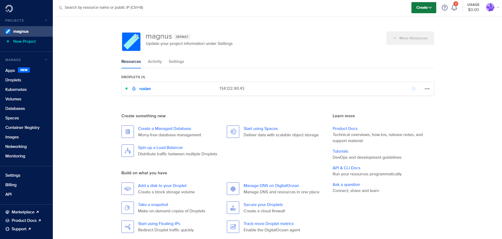
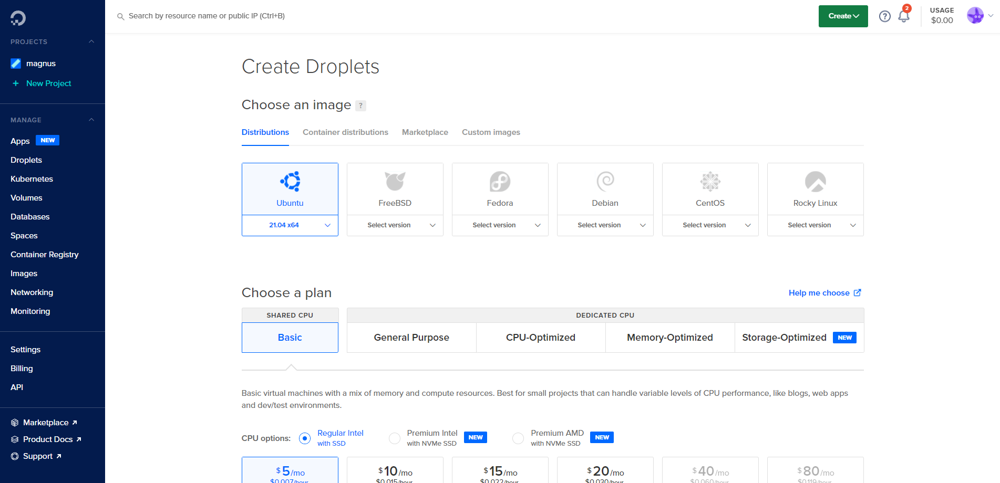
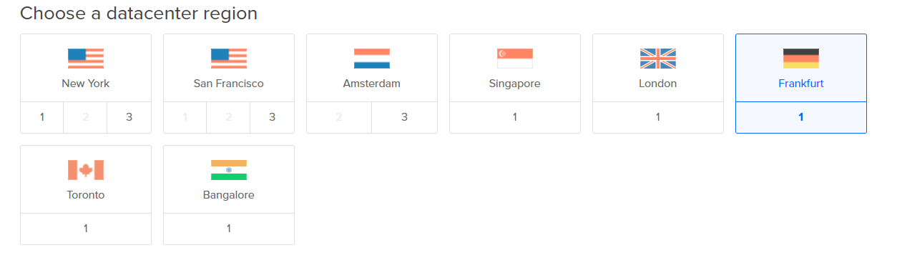
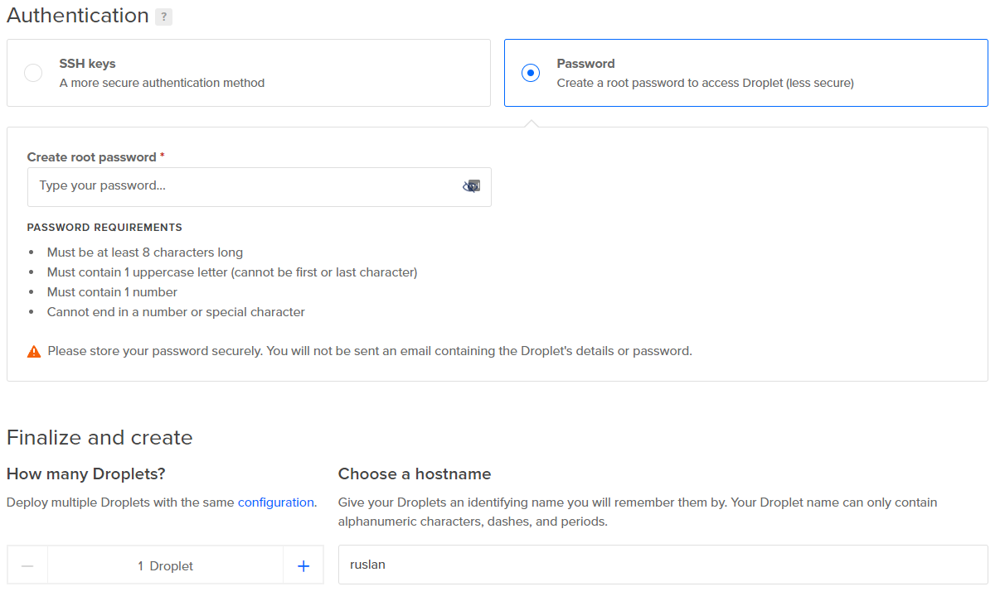

DigitalOcean - Server Opsætnings Guide
======================================

DigitalOcean er en hjemmeside som tilbyder virtuelle maskiner hvor man kan køre hjemmeside serverer på og meget andet.

Når du har fået GitHub PRO kan du gå ind på [DigitalOcean](https://www.digitalocean.com/github-students/) og følge deres vejledning til opretning af bruger.

Hvis du har fulgt instruktionerne rigtigt burde [din projects side](https://cloud.digitalocean.com) se sådan her ud:

Klik nu på den grønne create knap, og klik derefter på droplets, så burde du komme ind på denne side:

Vælg ubuntu, og en basic plan. Derefter rul ned til "Choose a datacenter region", her vælger du Frankfurt:

Herefter skal du vælge et password og et navn til din server:

Når du har fulgt punkterne her, kan du nederst på siden trykke "Create droplet". Nu har du din egen server!