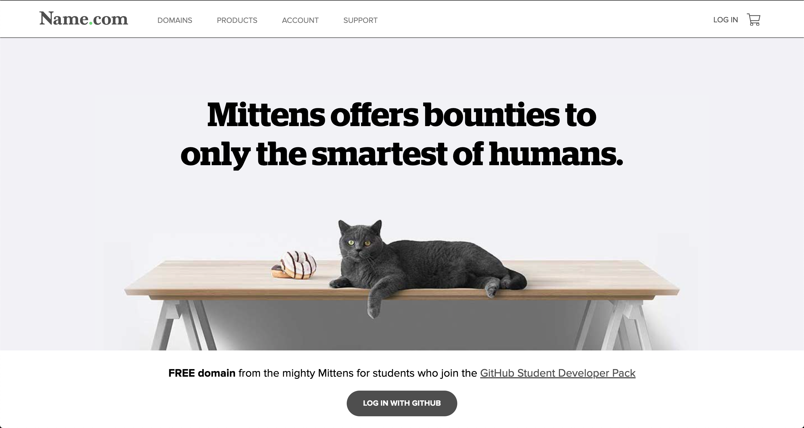
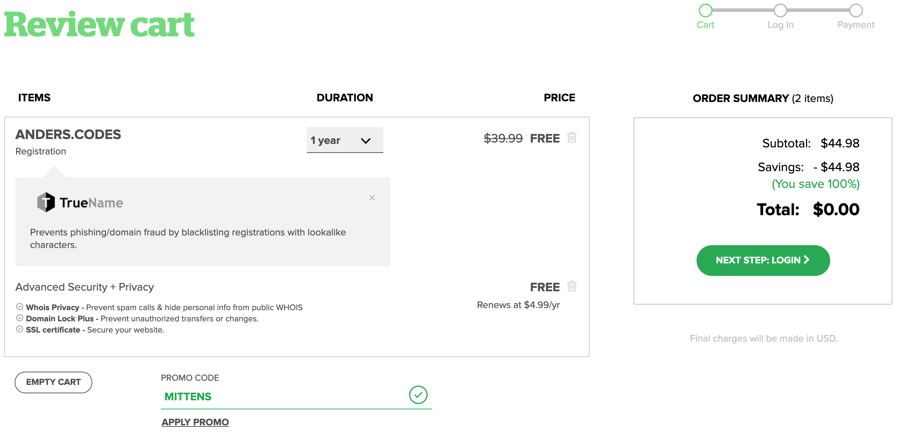
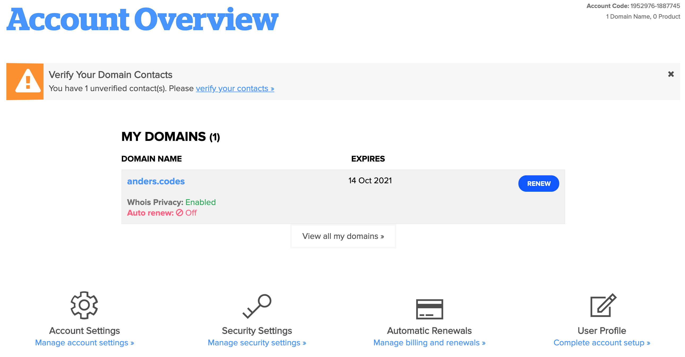
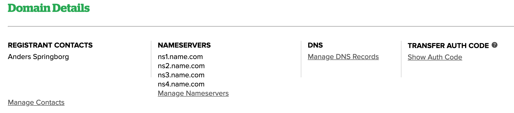
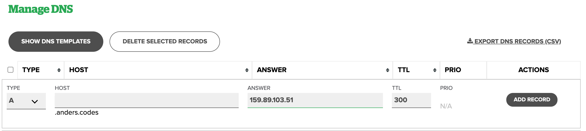
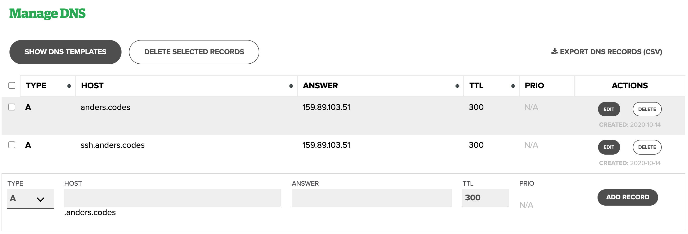

There's multiple sites that rents out domains. Sites like [GoDaddy](https://dk.godaddy.com/). With the [GitHub Education Pack: Domains](https://education.github.com/pack/offers?sort=popularity&tag=Domains) you can get a free domain from multiple sites, if you're a student.

For the rest of this tutorial, i'll be using [name.com with the github education pack](https://www.name.com/partner/github-students).



Log in with GitHub here to zero the price, create your account and complete the purchase. Find the domain you want to have and add it to your cart. 



> :warning: It is important that you verify your account by email before you continue.

Go to your account overview, and press your domain.




We will create a DNS Record - that is an entry in the DNS that tells it to forward any requests to your domain name to your server’s IP. We'll do that by going to `manage your dns`



Click enter your server’s IP and Add Record:



By doing this, we have effectively done the following mapping: 

Standard         |  My case
:-----:|:------:
`http://example.com  → YOUR IP ADDRESS` | `http://anders.codes → 159.89.103.51`

We can also add an ssh domain by making a new record with `ssh` in the host field. It will end up looking like this.



This makes you server accessible with
```properties
ssh root@ssh.anders.codes
```

Now you have a server, with your own domain!
