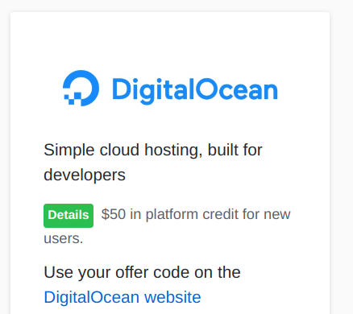
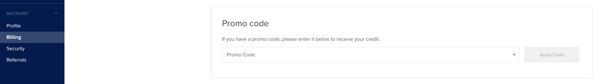
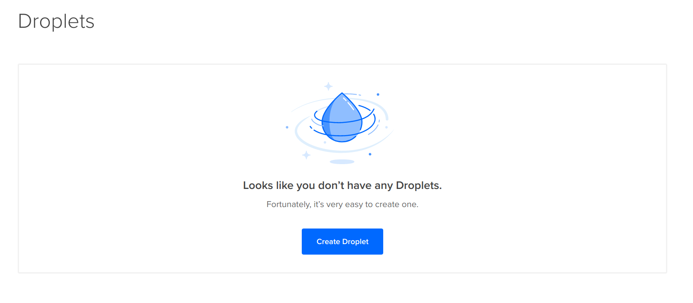
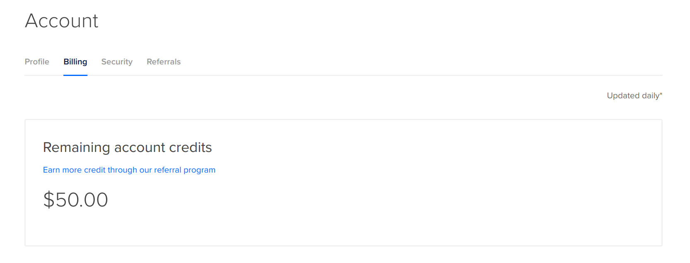
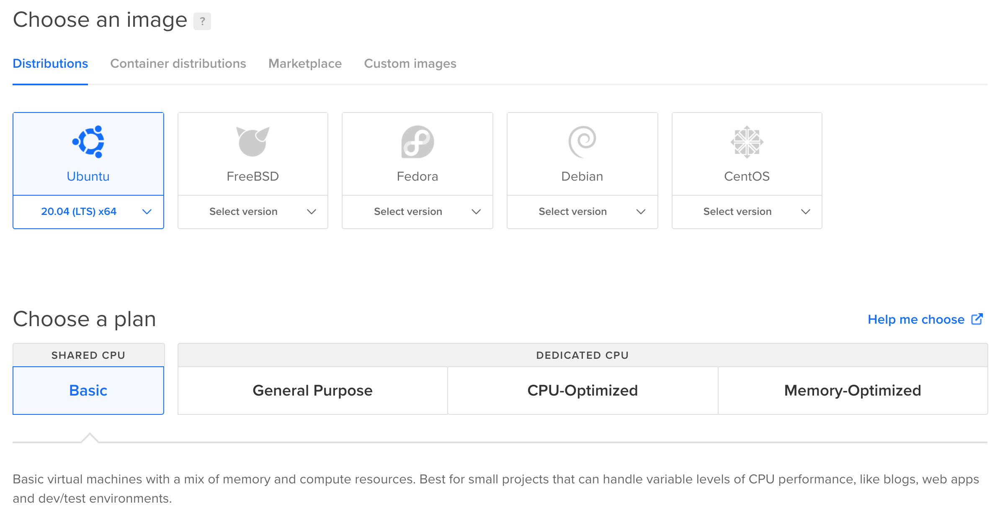
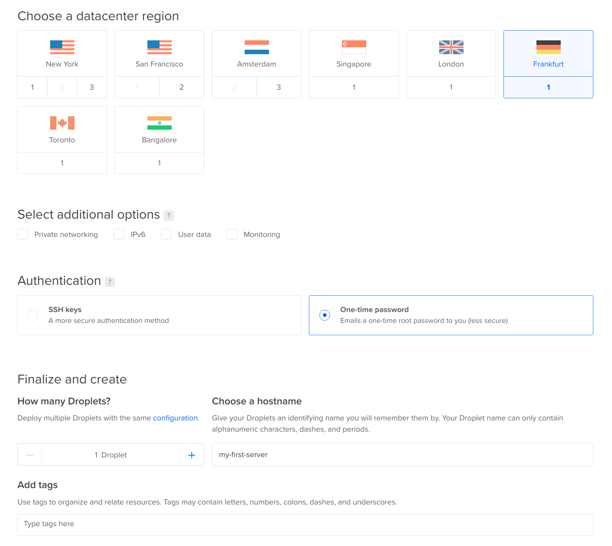
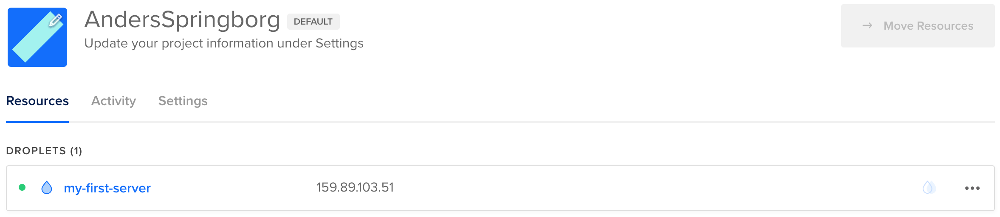

Using the GitHub Education Pack to get a free server and domain

To build a usable website, we need at least these two things:

1. An internet-connected computer running somewhere in the world (this is the server itself)
    1. The server has an IP address
2. A domain name (e.g. `example.com`) that points to the server’s IP address 

We will get both for free from the GitHub Education Pack. Visit https://education.github.com/pack/offers. 

The server

Find the DigitalOcean tab and request your code. After receiving your code, you should see the following: 

Follow the link. If you haven’t already, register an account with your GitHub account.
Enter your card information - don’t worry, DigitalOcean won’t bill you anything before you use their paid services. 

After logging in, go to you Account tab and navigate to the Billing sub-tab, find the Promo-code field: 

Enter your code from GitHub Education Pack.

You now have $50.00 in DigitalOcean credits. Congratulations!
DigitalOcean servers are called droplets.
Go to the Droplets tab and create a new Droplet: 

Continue with the following information. This will give you the cheapest possible server with: 

1. Ubuntu 20.04 LTS as the operating systems

After creating the Droplet, you should see the following information: 

You now have a live server with its own IP address `159.89.103.51` that you can access online! 

You have also received a one-time password in your email that you can use to log into the server. See [how to log into a server](server_logon) for how to access it, and [how to use a terminal](terminal) for an introduction to a bash terminal (mac and linux)
