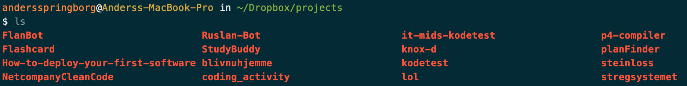
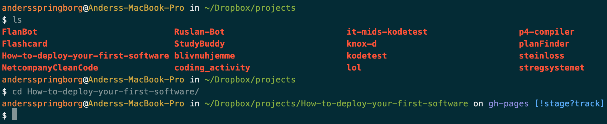
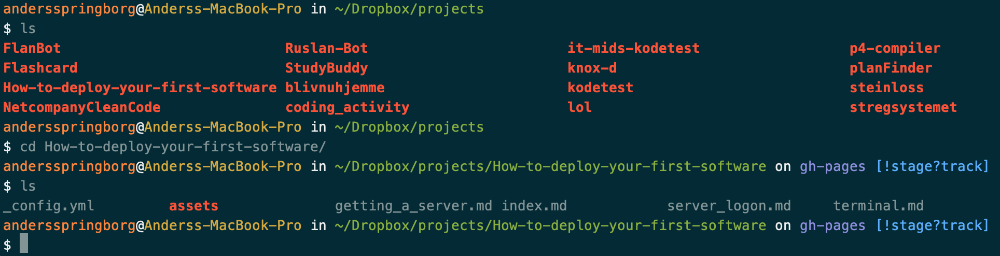
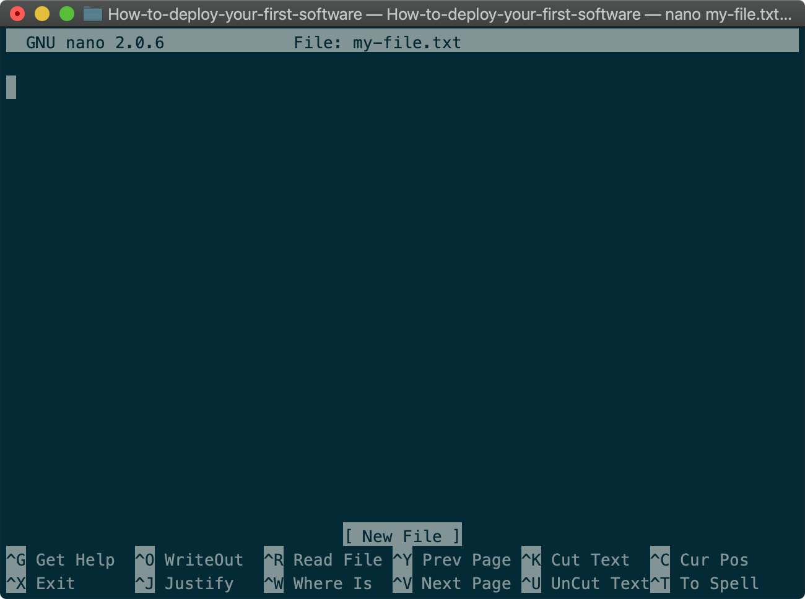
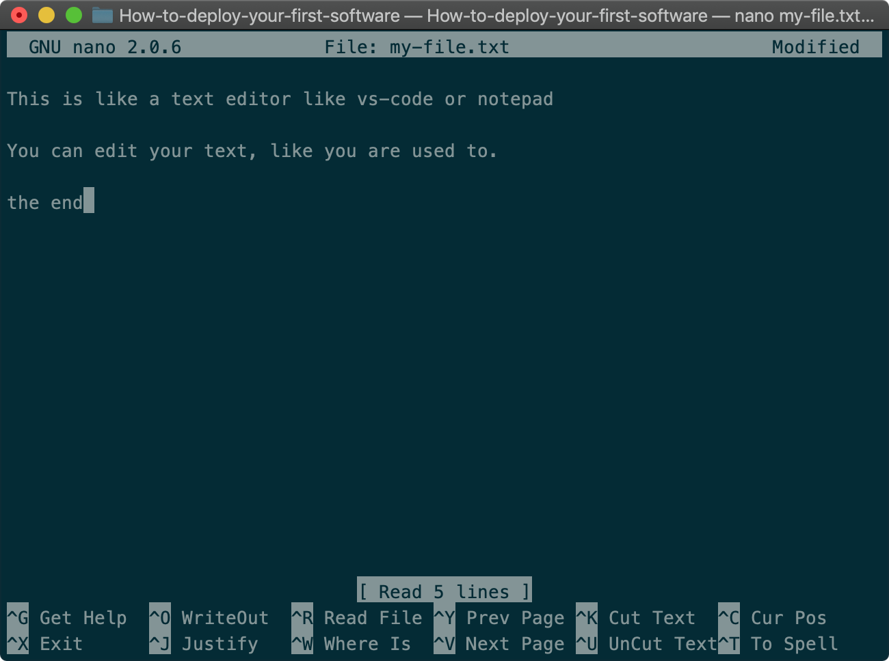
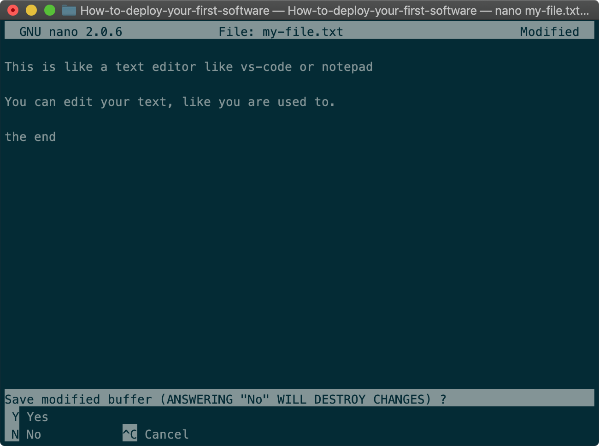
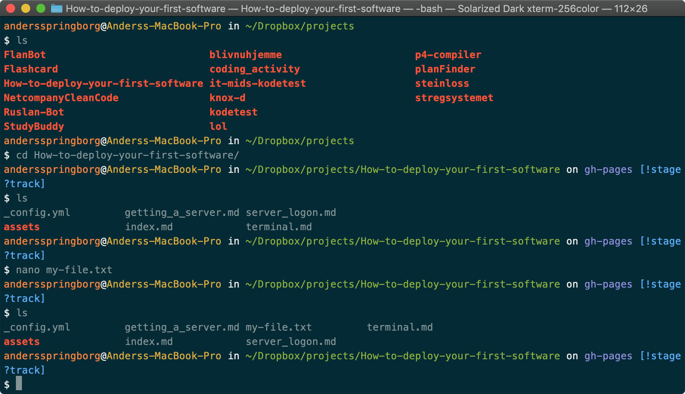

# Working with the terminal
Open a terminal app on your computer. This is where you will be doing all server-side work. 
Just to give an intuition of how this is going to work, try typing `ls` and press enter. You should see a listing of folders and files. 

From here, we can navigate in and out of folders, open files, and much more. To move into the folder `How-to-deploy-your-first-software`, simply type `cd How-to-deploy-your-first-software`: 

Typing `ls` again gives you the contents of the `How-to-deploy-your-first-software` folder: 

To create a new file, type `nano my-file.txt`, and the following will appear: 

Write some stuff in here. This is practically the same as opening the file in Notepad or any other editor, we are just doing it directly in the terminal with nano.

To save the file, press `CTRL + X`. This will exit the file, and it will ask whether you want to save the changes or not. Press `Y` and then `Enter`. 

Now, let’s see if the file was indeed created. Type `ls` in the terminal: 

And there is the new file! Open it with `cat` print the content in the terminal: 

Everything is as it should be. 
This is how we are going to create new/edit existing files on the server, since we only have access through a terminal. 