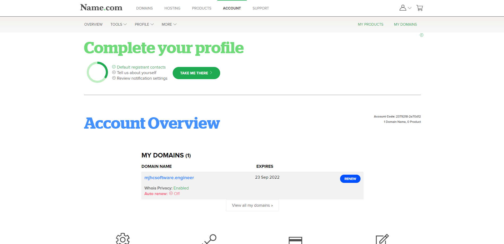

Name.com - Domæne Guide
=======================

Name.com tilbyder 1 års gratis domæne til studerende med en GitHub Student Developer Pack.

Opret en konto med din GitHub på [Name.com](https://www.name.com/partner/github-students) og følg instuktionerne på hjemmesiden.

Hvis du har gjort alting rigtigt burde din [account side](https://www.name.com/account) gerne se sådan her ud:

Klik på dit domæne navn, så får du nogle flere informationer og indstillinger:

