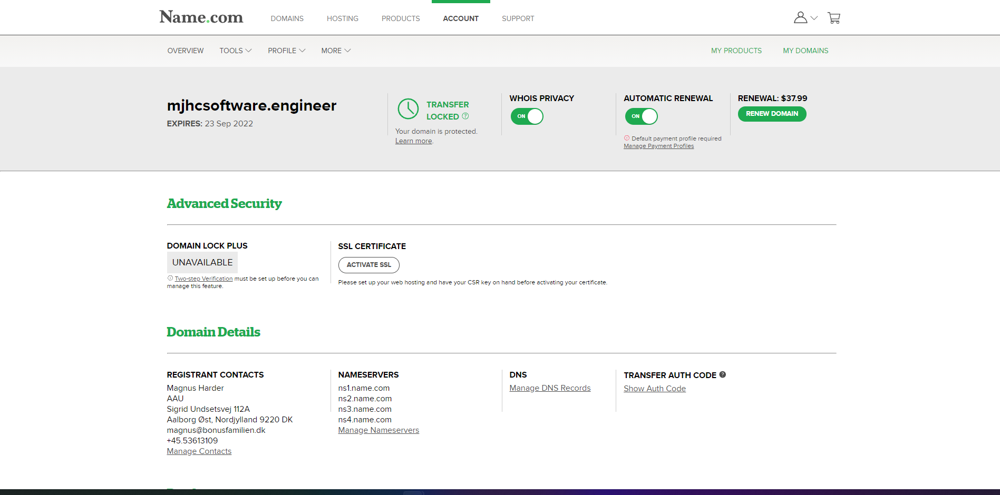
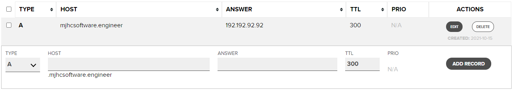

Name.com - Domæne Guide
=======================

Name.com tilbyder 1 års gratis domæne til studerende med en GitHub Student Developer Pack.

Opret en konto med din GitHub på [Name.com](https://www.name.com/partner/github-students) og følg instuktionerne på hjemmesiden.

Hvis du har gjort alting rigtigt burde din [account side](https://www.name.com/account) gerne se sådan her ud:

Klik på dit domæne navn, så får du nogle flere informationer og indstillinger:

Når du er inde på details siden, så skal du klikke på "Manage DNS Records" under **Domain Details**

Her fortæller du hvilken ip dit domæne skal peje hen på når at folk skriver det ind i deres browser. I feltet **ANSWER** skal du skrive din DigitalOcean Servers IP adresse. Du kan finde IPen under [Droplets](https://cloud.digitalocean.com/droplets) på din DigitalOcean side:

Nu kan folk komme ind på din hjemmeside! Nu skal den bare skrives:)