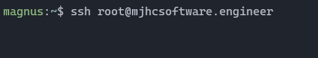
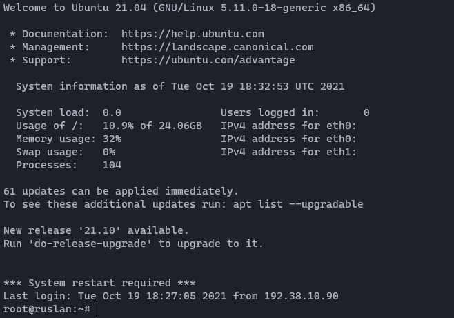

SSH - Fjernforbindelses Guide
=============================

Nu har du lavet en server, en NodeJS application og et domæne. Og nu skal du have koblet din NodeJS application til din server. Denne guide fortæller dig hvordan du opretter en SSH forbindelse til din server, hvor du vil køre din NodeJS application på

Du kan oprette forbindelse til din server, ved at skrive `ssh root@mydomain.com` i en terminal. Hvis du bruger windows, kan du bruge PowerShell. Jeg kan anbefale at du installere [WSL2](https://docs.microsoft.com/en-us/windows/wsl/install) på din windows maskine:)

Du vil blive bedt om at skrive adgangskoden til serveren (adgangskoden er den som du lavede til din DigitalOcean Droplet).

Hvis du ser en besked om nogle SSH Keys eller noget lignende når du opretter forbindelse, så skal du bare skrive `yes`

Når du har oprettet en SSH forbindelse til din server, burde du se noget lignende dette:

Nu er du inde på din DigitalOcean Droplet med en SSH forbindelse!