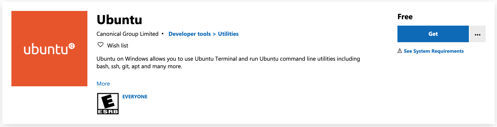
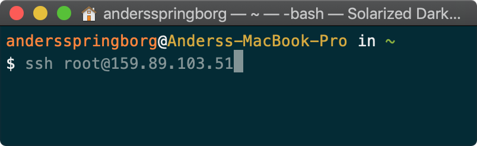
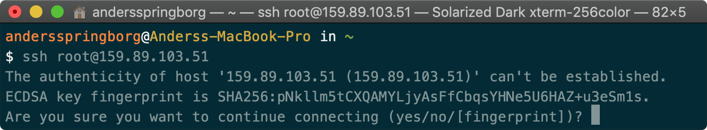
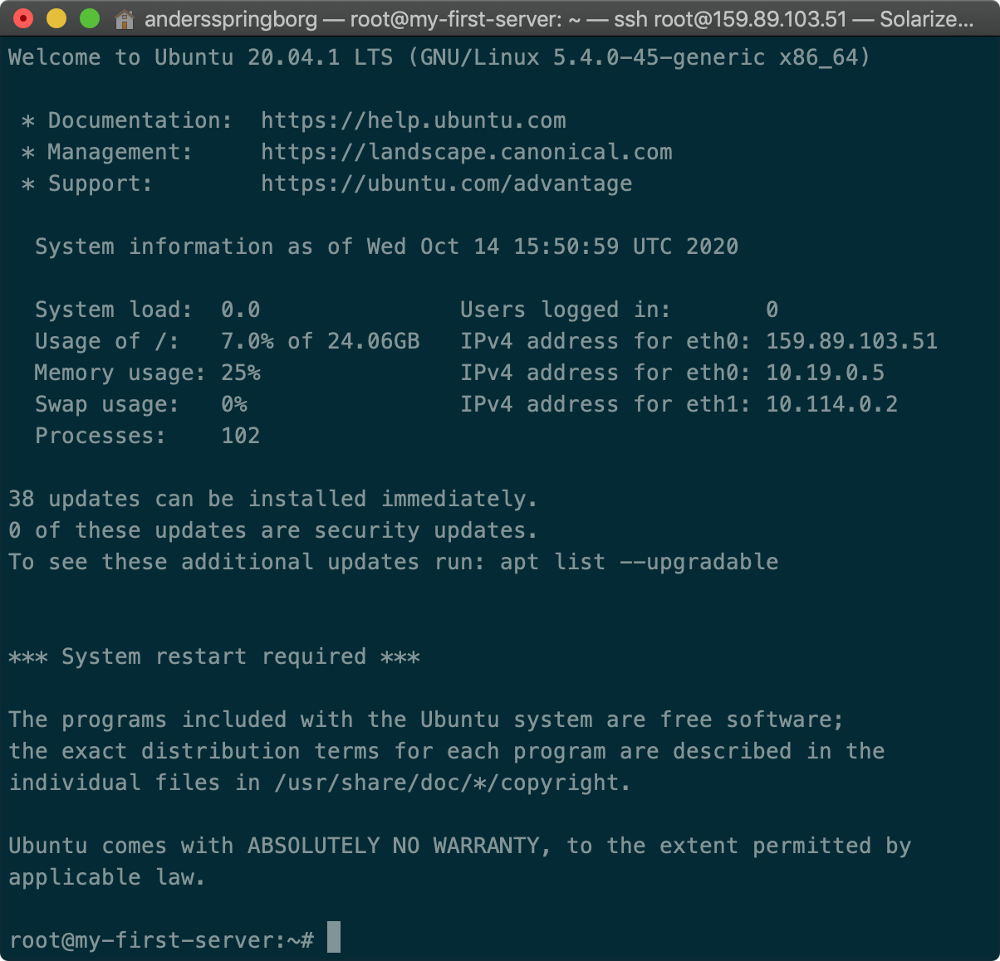
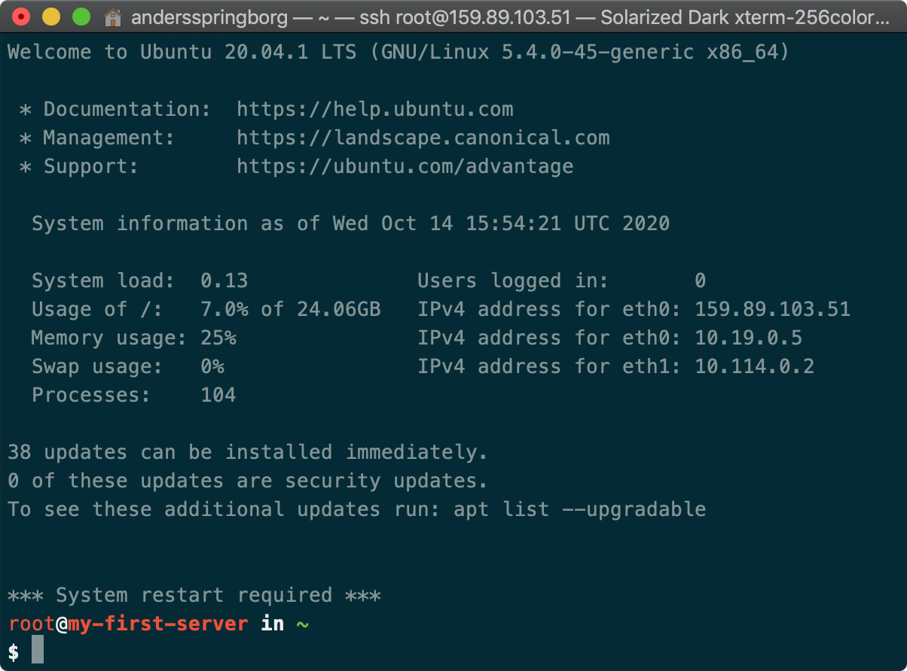
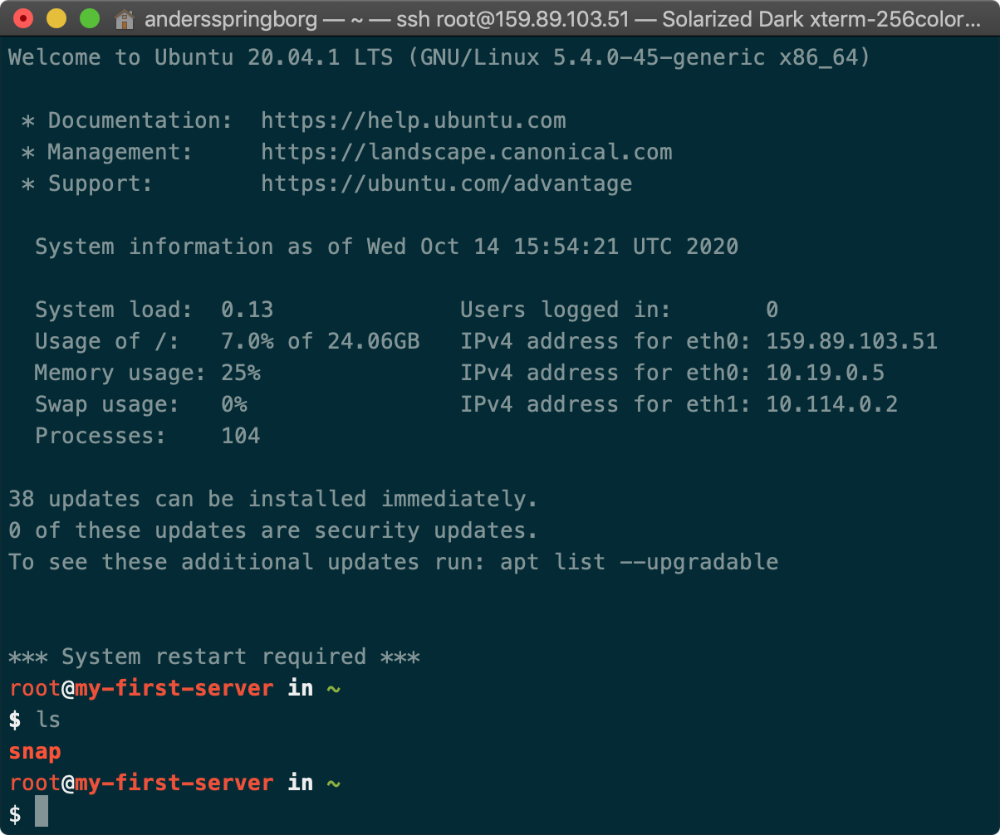
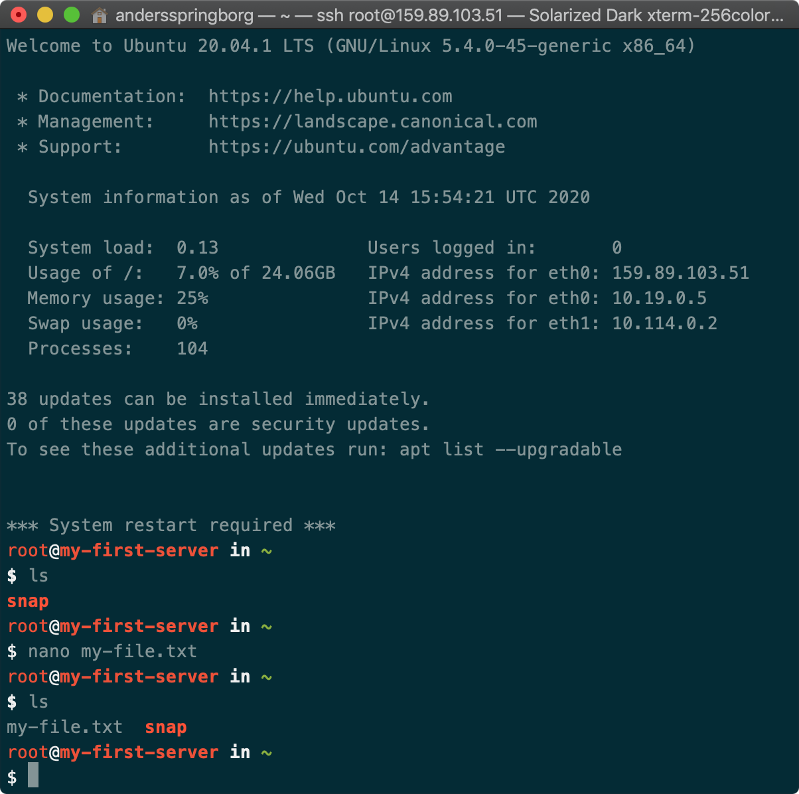

Logging into the server

If you are on windows, i recommend you to [install a Ubuntu subsystem](https://ubuntu.com/tutorials/ubuntu-on-windows#1-overview), where there's a bash terminal. It's a windows store app


The server is essentially just a computer running somewhere in Frankfurt that we can log into. We currently have one user, `root`, and we have received a password in our email. We will log into the server using SSH, which really just enables us to access the server’s terminal through our own.

From your terminal, enter the following: 
```properties
ssh root@YOUR_IP_ADDRESS
```

… and enter your provided/or chosen password.
Your provided password is a one-time only password, so you will have to enter you own. 

If you get a popup like this, just type yes and press enter. It adds this server to a folder called `known_host`.


1. Enter the password DigitalOcean gave you (the one you just used)
2. Enter your own new password
3. Enter your own new password again
4. You are now running the terminal on your server!
Which will look like the picture on left, or with my a color theme like on the left

Standard         |  Colored
:-----:|:------:
  |  


If you run `ls`, you will see that nothing is there yet. Let’s make a folder for our coming server architecture. 


Create the file we just made, just on the server this time. Run `nano my-file.txt` and put some content in there. Save and quit and run `ls`:




You are now logged into your remote server!