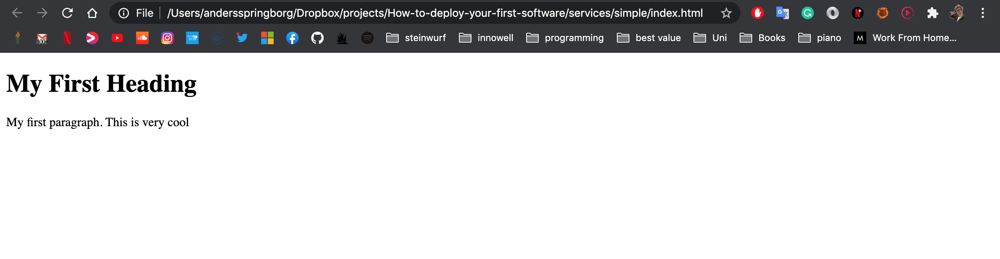
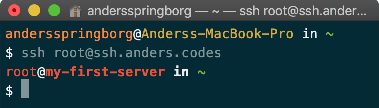
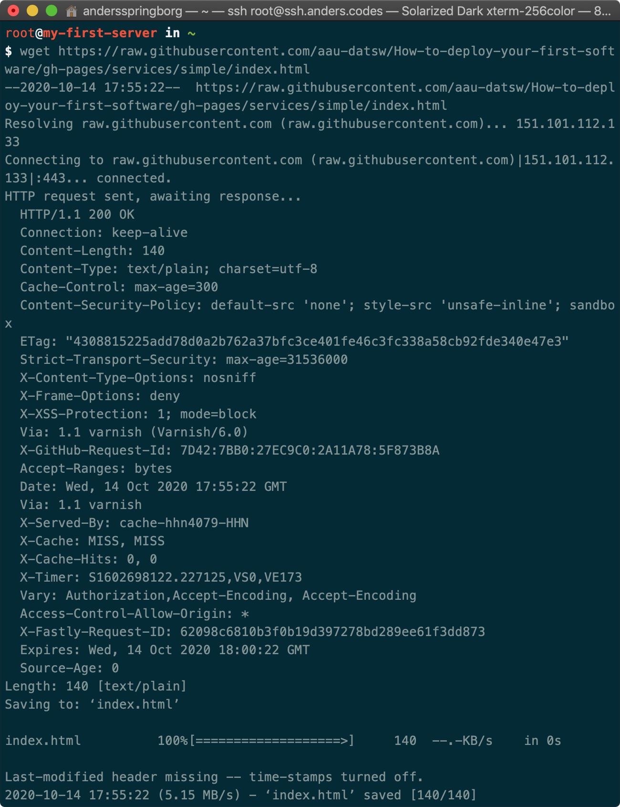
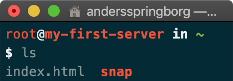
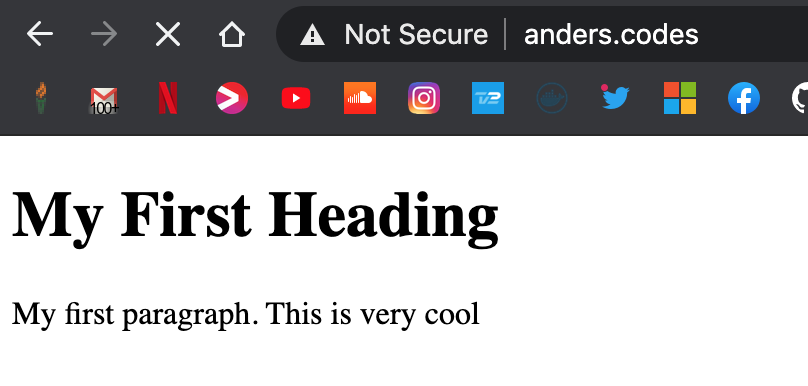

Now that we have a server, with a domain. We want something to run on it. You can have some a `C`program running just `printf("hello")` everyday. Then you have to login into the server everyday to see it. Normally you would have a webpage, or more specific a `HTML` page running.


This will show you how to setup a simple `HTML` page, when you access your server domain. If this is not your first webpage, and you're want to host it with a frameworks, goto the [table of content](index) and choose a framework. 

First, we'll have to create the HTML file
```html
<!DOCTYPE html>
<html>
    <body>
        <h1>My First Heading</h1>
        <p>My first paragraph. This is very cool</p>
    </body>
</html>
```

You can open this on your own computer, and it'll open it in the browser



But we want it on our server. There's multiple ways to get it there. You could use git, [see the tutorial for that](git). We're gonna use `wget` which just downloads a file. We're gonna download [this file](https://github.com/aau-datsw/How-to-deploy-your-first-software/blob/gh-pages/services/simple/index.html), which is the code from above. [We're gonna use the raw file, which is this link](https://raw.githubusercontent.com/aau-datsw/How-to-deploy-your-first-software/gh-pages/services/simple/index.html). Go to both links if that seems confusing.
1. Login to your server
    
2. Wget the file
    
3. Make sure it's there
    

When you go to a webpage like [google.com] we actually just get a file on google's server, just like when you opened the file on your local computer(with a framework, it's a bit more complicated than that). For us to show the `index.html` file, we run:
```bash
nc -kl 80 < index.html
```

This hosts our file on port 80.
Normally a ip uses [different ports](https://www.iana.org/assignments/service-names-port-numbers/service-names-port-numbers.xhtml), for different things. Like ssh is normally port 22, which we use to login to the server. Port 80 is the default in browsers also called `HTTP`.

Now we can access our html file on our domain!!


This only runs, when you're logged into your server, and running the command. If you want it to run forever, when you're not logged in, run the command
```bash
screen python3 -m http.server -d ./ 80
```
and then press ´ctrl+a+d´. You can now exit your server by typing `exit` and everthung will still run

Now you have your first homepage. 

To get back to your python program type `screen -rx` on your server


